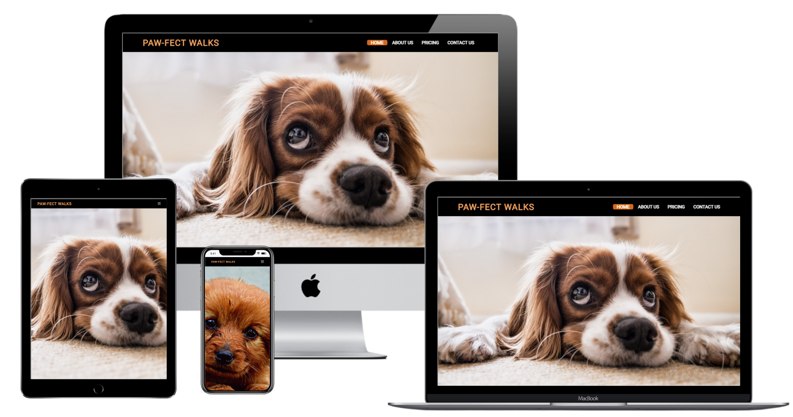

<h1 align="center">Paw-fect Walks</h1>

Paw-fect Walks is a fictious website written in HTML and CSS. It was designed for a dog walking service for the wider community of Croydon. This website also provides walking services in neighbouring areas including Banstead, Sanderstead and Kenley. 

[View the live project here.](https://joycey83.github.io/Paw-fect-Walks/)

My approach for designing this website was to create it being mobile responsive first and for the webpage being accessible on a range of devices, making it easy to navigate for all users.

-----
# Target Audience

There was a time that I think people thought of dog walkers as a luxury service.  A luxury for people who can’t be bothered walking their dog or too lazy to dedicate the time actually needed to be a dog owner.  I think those times have changed and people are more aware of both the needs of a dog and the wide variety of reasons to hire a dog walker.
We all know that in reality, life is never simple.   For me, a dog walker was something that I had to have in place before even considering Woody & Ava coming into my life as my work pattern could vary on certain days and at short notice. It’s that complexity of life that in my own experience means people seek out a dog walker for 5 common reasons. Of course there could be many more.

The website hopes to attract 5 main types of customers

1. Customers working long hours at the office
2. High energy breed dog was choosen as a pet
3. Health issues restricting mobility of the owner
4. Recognising dog walking will improve the dogs welbeing
5. behavioural support of your dog

Other  type of users could be customers who have families with young children but owns dogs but due to time contraints with work and raising a family etc. so they need a helping hand from dog walking services like Paw-fect Walks. The other type of users could be very experienced dog owners who live in the local vicinity but due to having a busy work schedule or just being busy for that particular time period those users will consider using community dog walking services like Paw-fect Walks. 

-----
# User Experience (UX)

+ ## User Stories

    - ### First Time User
    1. As a first time user, I Should be able to quickly gain an outline of what Paw-fect Walks website is about via the Home page.
    2. As a first time user, I want to be able to navigate through out the site with ease.
    3. As a first time user, I want to be able to read customer reviews to hear their thoughts on the service that is provided so that I know that they can be trusted with my dogs.
    4. As a first time user, I should be able to get detailed information on different price packages that is on offer.
    5. As a first time user, I should be able to contact the website and make a booking for walks or find out further information that is not listed on the website.
    6. As a first time user, I should be able to locate their social media links to see how trusted and known that they are in the local community.

    - ### Returning Users
    1. As a returning user, I want to be able to access more information regarding about the dog walking service that Paw-fect Walks will be providing on the website.
    2. As a returning user, I want to be able to engage or be part with the Paw-fect Walk community communicating via different social media platforms such as Twitter etc.
    3. As a returning user, they should be able to get an understanding of Paw-fect Walks company values.
    - ### Frequent Users
    1. As a frequent user, I want to be able to check if there are updated new price plans or updated new price packages.
    2. As a frequent user, I want to know if the website added any new information regarding about different service that they will provide in the future for example dog bording or dog sitting.
    3. As a frequent user, I want to know if there are any changes to the website or organisation.
    
    ---
    # Design
    
    
    + ## Colour Scheme
    The colours that are choosen are predominantly made up of different variations of White, black and brown. This colour scheme was purposely chosen because this is the tri color of all breeds of dogs. I want this type of colour scheme flowing through out my site.

    There are an exceptions to just using variations of tri-color  I have used two different types of red one for my sub heading on the Reason section on the landing page so that the the user can read it more clearly and Tomatoe red for my contact form. As there is a dark background image being used for my contact info Golden Rod was used for easy readability. In total I have used 14 colours but they are just made up of three main colours of White, black and Brown. 

    ### Color Reference

| Color             | Hex                                                                |
| ----------------- | ------------------------------------------------------------------ |
| Sandy Brown   |   #f4a460 |
| Ivory         |   #fffff0 |
| Gainsboro     |   #dcdcdc |
| Black         |   #000000 |
| White         |   #ffffff |
| Dark Gray     |   #a9a9a9 |
| Saddle Brown  |   #8B4513 |
| Sienna        |   #a0522d |
| Slate Gray    |   #708090 |
| Bisque        |   #ffe4c4 |
| Chocolate     |   #d2691e |
| Golden Rod    |   #daa520 |
| Red           |   #ff0000 |
| Tomatoe Red   |   #ff6347 |

+ ## Typography
The Roboto and Babas Nueue font is the main font used throughout the whole website with Sans Serif as the fallback font in case for any reason the font isn't being imported into the site correctly. Roboto was choosen as the font had a clean,sleek look and has a high readability on the website no matter which colour was used.

+ ## Imagery
Throughout the website there are various background and hero imagery of different dog breeds and parks. They are designed to envoke an emotional response with the user so when they see images of dogs and parks subconciously this will make them think about their own dogs welbeing from a mentally and physically point of view.

+ ## Wireframes

  * Desktop
  [View Desktop Wireframes](assets/images/desktop-wireframes.jpg)
  * Tablet
  [View Tablet Wireframes](assets/images/tablet-wireframes.jpg)
  * Mobile
  [View Mobile Wireframes](assets/images/mobile-wireframes.jpg)

# Features
## Existing Features

* **Header**
  * This contains the Paw-fect Walks company logo and the navigation elements
  * This section of the website introduces the user to Paw-fect Walks with a extremely large close up image of a
  Cavalier King Charles Spaniel. This striking image of the dog laying on the carpet with its big sad looking eyes looking upwards will try and trigger an emotional response with the user. This will make them think of the times when they didn't have time to take their own dogs for a walk.

  
  
  

  * **Navigation Bar**
  * The navigation bar consists of 4 navigation links, they are **Home**, **About Us**, **Price** and **Contact Us**.
  * The **Home** link takes the user to top of the *Home page*.
  * The **About Us** link directs the user to the about page. Also located within the *Home page*, users will have access to more information about the owner and company of Paw-fect Walks as the user reads on there is a **Read more** button when it is clicked the button will direct the user to the *price packages* that is on offer.
  * The **Price** link directs the user to the Price page. Also located within the Home page. The price page contains detailed information on the type of prices ranging from solo walks, group walks and weekend group walks. By providing a detailed price plan this means the user can make an informed decision on the type of service that they need from our dog walking service. If they need something more tailored they can also contact us via the Contact Us page. The link is also located on navigation bar on the top of the price page.
  * The **Contact Us** link directs users to the contact page. Also located within the *Home page*, by following through with the **Contact Us** page a contact form will be presented for the user to contact us either for more information about our services or just for a general enquiry. If the user chooses to select other pages they can do so as all other navigation links are consistently placed at the top of every page.

  
  
  * One of the main design element for being mobile responsive is that the navigation bar will turn into a hamburger menu when the site is viewed on tablet and mobile devices. when viewed on smaller screen the navigation bar will switch to a sliding menu which will enforce easier readability and better user experience.
 
  * When the user view the site on mobile screens that are under 700px the hero image will also change to a much smaller image of a puppy dog. By changing the image and size this will enable the site to load faster for users using smaller mobile devices. This will enable the user to have a better experience when navigating through the site.
   

* **Home page**
  * The home page starts with the hero image and is divided into a 3 sections.
  * The **Five Reason** section this shows 5 dog images and when you hover over them they will contain a brief explaination why the user should use choose us for providing their dog walking needs. The hover animation also provides a fun and effective way to draw in users attention on to the site.
  [View 5 Reason section](assets/images/reason-section.jpg)
  * The **Testimonal** section which will enable the user to read past and current client reviews on the service that is provided so that the user will know that the company can be trusted when the dogs are in the care of the dog walkers.
  [View Testimonal section](assets/images/testimonal-section.JPG)
  * The **Accreditation** section this will enable the user to have extra reasurrance that our company are safe that we have high standards and credability to be looking after the clients dogs.
  [View Accreditation section](assets/images/accreditation-section.JPG)
  * The Accreditation section are also designed to be responsive on tablets and smaller devices.They will stack on top of each other so it will retain 100% readability.
   [View Mobile version of Accreditation ](assets/images/mobile-accrediation.JPG)

* **About Us**
  * The about us page opens up with a simple friendly introduction *Hi Fellow dog lovers!* this will enable the user to feel at ease and to let them know we are a friendly and professional company.
  * The **About Us** page contains a introduction about the owner of the company, why the company was set up and the safety features.
  * The purpose is to give the user a feeling that this small independent company is flexible and capable of meeting every dog's walking needs.
  [View About Us](assets/images/about-us.JPG)
* **Pricing**
  * On this page the user can find detailed information regarding about the different types of price packages that Paw-fect Walks has to offer to its protential/existing clients.
  * There 3 main types of packages for the user to choose from, Solo walks, Group walks and Weekend walks.
  * The pricing cards are designed in mind of the user, meaning that we want the user to be able to see the prices in detail but at the same time clearly and not in a confusing manner with loads of tables or drop down boxes that other competitor sites do.
  * our design is simple it just shows 3 price cards with a large font size heading and the prices being in Roboto font which gives high readability for the user. for continuity of the flow of the site there is a striking sunny background image of the park which comes hand in hand with dog walking. Also for continuity the price cards all have a background colour of variations of tri-color of Black, brown and white. 
  [View Price Plan](assets/images/price.JPG)
* **Contact Us**
  * On this page the user can find a contact form which the user can fill in their personal details and message the company directly.
  * The form allows the user to either ask more information about our services or they can use the form to book walks with us. 
  * The user will be asked to submit their full name, email address, enter a subject and also enter a message. Once the form is submitted the user will be taken to a Thank you page, with the full navigation links being visable,enabling them to continue their journey through the site.
  * They can also contact us through traditional channels such as by post or by phone.
  * There is also a google map, allowing the users to know where the company actually located.
  [View Contact Us form](assets/images/contact-form.JPG)
* **Thank You page**
  * This page is only viewed as a result of submitting the application form on the contact page. It gives the user a confirmation of the submission and sends a positive message from Paw-fect Walks.
  * The thank you page has the same header and footer as the homepage to let the user easily find the way back to the rest of the site.
  [View Thank You page](assets/images/thanks.JPG)
* **The Footer**
  * The footer, like the header, is consistent throughout the site. It contains links to Paw-fect Walks social media channels. 
  [View Footer](assets/images/footer.JPG)
  * It is also fully responsive across all tablet and mobile devices.
  [View Mobile version of Footer](assets/images/mobile-footer.JPG)
* **Features left to implement**

  There are quite a few features that I like to implement in the future for this website:
  * A Paw-fect Walk blog page or section, so I can give regular updates about my own dogs so that there are more interaction with the wider community of Croydon.
  * When the company expands in the future new services such as Dog sitting, Dog boarding will be added to the website for new and existing users.
  * Gallery page to increase more traffic to my website as the human brain processes images a lot faster than processing text or content. by showcasing a vast of images this will encourage protential customers to connect with you and your company too, this will help them to decide if they want to be using your services.
  * Log in system for existing customers so that if they have a profile on our website they could check payment history and they could see daily updates about their dogs, especially when the company expands to other services like dog sitting and dog boarding.
  * Online booking system will be implemented in the future for existing and protential users so that it will be easier to book walks because as of now users will need to fill in the contact form, call or phone us to make a booking.

  ----
  # Technologies Used
  ## Languages used
+ HTML5
[View Information ](https://en.wikipedia.org/wiki/HTML5)
+ CSS
[View Information ](https://en.wikipedia.org/wiki/CSS)

---
 # Frameworks & Programs Used

1. Google Fonts was used to import the Roboto,Baba Neues and fall back font Sans Serif. Roboto font was mainly used through out the pages on the website. [Google Fonts ](https://fonts.google.com/?query=roboto&preview.text=Paw-fect%20Walks&preview.text_type=custom)
2. Font Awesome was used on most pages throughout the website to add icons for aesthetic and UX purposes. Font Awesome was also used for the mobile hamburger navigation menu.
[Font Awesome ](https://fontawesome.com/v5.15/icons?d=gallery&p=2&m=free)
3. Youtube tutorials on learning how to use Flexbox, CSS Grid, Hover effect and cards was used.
[YouTube ](https://www.youtube.com/results?search_query=flex+boxes+css)
4. Windows 10 Paint was used on resizing my images though out my site.
[Window 10 Paint](assets/images/paint.JPG)
5. Balsamiq was used to create the wireframes during the design process.
[Balsamiq ](https://balsamiq.com/wireframes/?gclid=CjwKCAjw2bmLBhBREiwAZ6ugo1QxIXgRy5ZEQs1vd9gCXmKeC4o2Mzk23m-ooHCIrcS84BxMiZbe5RoCcEIQAvD_BwE)
6. Git was used for my project workspace.All the codes are saved on Git. All my codes was committed on Git and pushed to Github
[Git ](https://en.wikipedia.org/wiki/Git)
7. GitHub was used to store the codes from my project after being pushed from Git
[Git ](https://en.wikipedia.org/wiki/GitHub)

  
  

